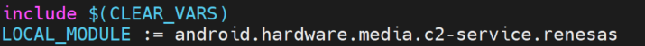
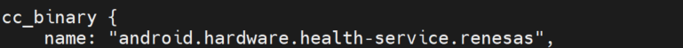

# FAQ

If you have any questions about RZ AOSP BSP, please create an issue at:

[GitHub Issues](https://github.com/renesas-rz/rz_aosp/issues){: target="_blank" }: For technical questions, bug reports, or feature requests related to RZ AOSP.

!!! note
    A GitHub account is required to create an issue.

---

### Q1. How to add new package to RZ AOSP BSP?

Please find package name from
Android.mk

<br>
or Android.bp
<br>

<br>
Then please add package name to `${workspace}/mydroid/device/renesas/common/DeviceCommon.mk` like below:
```bash
PRODUCT_PACKAGES += \
    android.hardware.media.c2-service.renesas \
    android.hardware.health-service.renesas 
```

<span style="color:blue">**Note:**</span> It's required to write SELinux policies for these packages, please refer to [Security-Enhanced Linux in Android](https://source.android.com/docs/security/features/selinux/device-policy){: target="_blank" }

### Q2. How to copy file to RZ AOSP BSP?

Example: Copying file `${workspace}/mydroid/device/renesas/common/fstab.sdboot_slot1` to vendor partition (/vendor/) after booting.
Please add below contents to `${workspace}/mydroid/device/renesas/common/DeviceCommon.mk`:
```bash
PRODUCT_COPY_FILES += \
    device/renesas/common/fstab.sdboot_slot1:$(TARGET_COPY_OUT_VENDOR)/etc/fstab.sdboot_slot1
```
See more examples at `${workspace}/mydroid/device/renesas/common/DeviceCommon.mk`

### Q3. How to port Linux AI application to RZ AOSP?

Please access [AI Application Porting Guide](../ai-application-porting-guide/index.md)

### Q4. How to change display resolution?

Please check [Booting with video parameter set](../application-notes/#booting-with-video-parameter-set)

### Q5. What is the AI performance of the RZ/V2H Software Package for AOSP 15?

Please refer to the list below
<br>
[https://github.com/renesas-rz/rzv_drp-ai_tvm/blob/v2.6.0/docs/model_list/Model_List_V2H.md](https://github.com/renesas-rz/rzv_drp-ai_tvm/blob/v2.6.0/docs/model_list/Model_List_V2H.md){: target="_blank" }

In AOSP, inference time increases by approximately 20% to 50% compared to Linux, due to factors such as the addition
of the HAL based on the Android architecture. Actual performance is also influenced by the AI model, system configuration,
and other factors.
