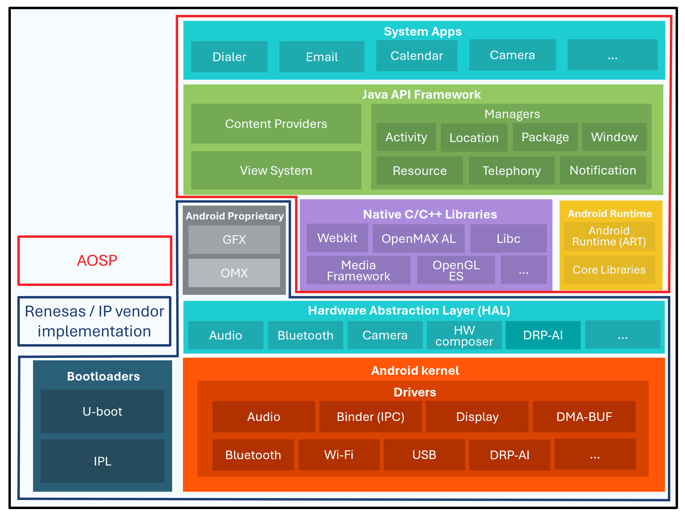

# Overview

{ align=right width=55% }

The RZ/V2H Software Package for AOSP 15 provides an [AOSP](https://source.android.com/){: target="_blank" }-based Android environment with development tools, system libraries, and graphics and multimedia support.

For an easy setup and quick access to the RZ/V2H Software Package for AOSP 15, please refer to [Quick Start Guides](quick-start-guides/index.md). For a customized Android environment, please refer to [How to build RZ AOSP from Source Code](how-to-build-aosp-from-source-code/index.md).

The package also supports the Renesas AI accelerator DRP-AI and its model compilation toolchain, and provides the DRP-AI Driver, DRP-AI HAL, and runtime libraries. These components can be used through [AI Applications](ai-applications/index.md). For porting Linux-based AI applications to Android, please refer to the [AI Application Porting Guide](ai-application-porting-guide/index.md).

## **Supported boards**

* RZ/V2H with 16 GBytes DDR memory on EVK board

| Board | MPU | LSI | Revision | Power Circuit | Supported |
|:---:|:---:|:---:|:---:|:---:|:---:|
| RZ/V2H Evaluation Board Kit| RZ/V2H | 1 | 1 | - | ✓ |

## **RZ AOSP Components**

The RZ AOSP release package has been developed and tested using the following software and hardware environment.

* **Based Kernel version:**
    It is merged with the below 2 kernels:
    * Android Common Kernel: 6.1.99
        * Tag: ASB-2024-10-05_14-6.1. Commit id: 0e8b65e.
        * Tag: android-15.0.0_r0.98. Commit id: 3c76c2d.
    * Linux®: v6.1.107-cip28.
* **Android Open Source Project (AOSP):** AOSP 15 based on android-15.0.0_r23
* **Toolchain for kernel/drivers and bootloaders:** ARM GCC 9.2 and Android clang 19.0.1
* **Build Host OS:** Ubuntu 20.04 64-bit (official testing) or Ubuntu 22.04 64-bit (Unofficial testing). Newer Ubuntu version may also work.
* **Minimum required DDR memory size:** 16 GBytes
* **Storage size:** At least 250 GBytes of free disk space to check out the code and an extra 150 GBytes to build
