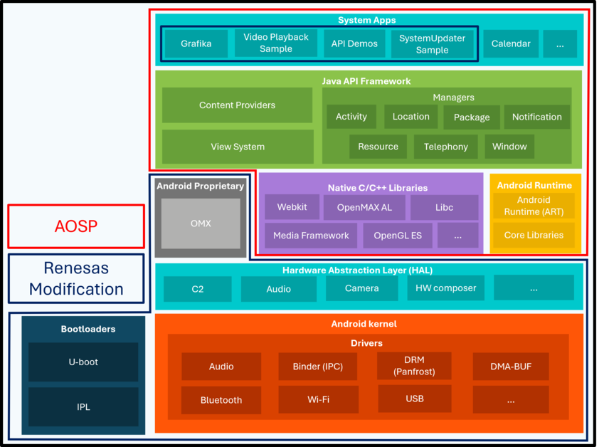

!!! info
    Looking for another release?
    See the [Home](../index.md) page for all supported releases.

## **RZ/G3L Software Package for AOSP 17**

{ align=right width=60% }

The RZ/G3L Software Package for AOSP 17 provides an [AOSP](https://source.android.com/){: target="_blank" }-based Android environment with development tools, system libraries, and graphics and multimedia support.

For an easy setup and quick access to the RZ/G3L Software Package for AOSP 17, please refer to [Quick Start Guides](../quick-start-guides/index.md). For a customized Android environment, please refer to [How to build RZ AOSP from Source Code](../how-to-build-aosp-from-source-code/index.md).

This release introduces Suspend-to-RAM (S2R) mode support, helping reduce power consumption while enabling faster system startup than a cold boot and allowing users to quickly continue from where they left off, please refer to [Suspend to RAM](../application-notes/#suspend-to-ram)

## **Supported boards**

* RZ/G3L with 2 GBytes DDR memory on EVK board

| Board | MPU | LSI | Revision | Power Circuit | Supported |
|:---:|:---:|:---:|:---:|:---:|:---:|
| RZ/G3L Evaluation Board Kit| RZ/G3L | 1 | 1 | ✓ | ✓ |

## **RZ AOSP Components**

The RZ AOSP release package has been developed and tested using the following software and hardware environment.

* **Based Kernel version:**
    It is merged with the below 2 kernels:
    * Android Common Kernel: 6.12.60
        * Tag: ASB-2026-01-05_16-6.12. Commit id: d3ea9250f3.
    * Linux®: v6.12.46-cip8.
* **Android Open Source Project (AOSP):** AOSP 17 based on android-17.0.0_r1
* **Toolchain for kernel/drivers and bootloaders:** ARM GCC 9.2 and Android clang 22.0.0
* **Build Host OS:** Ubuntu 22.04 64-bit. Newer Ubuntu version may also work.
* **Minimum required DDR memory size:** 64 GBytes
* **Storage size:** At least 300 GBytes of free disk space to check out the code and an extra 150 GBytes to build
